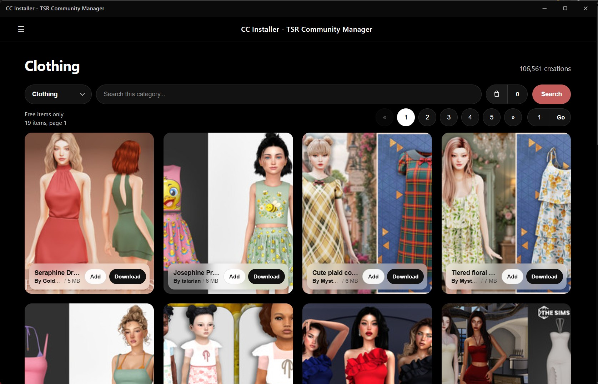
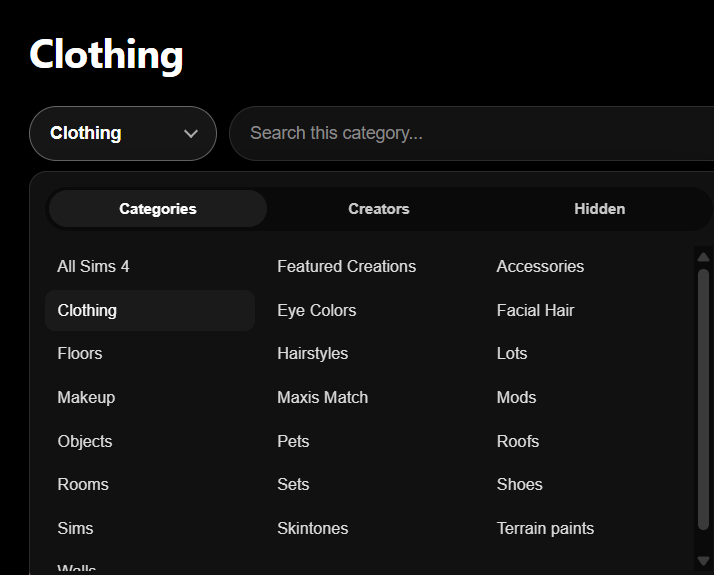

# CC Installer - TSR Community Manager

[](https://github.com/psf/black) [](./LICENSE)


I made this because downloading from The Sims Resource is a pain: 15 second waits, one file at a time, and VIP ads everywhere.

The default app is a desktop window (Flask + pywebview). It browses free Sims 4 content, skips VIP / early access, and installs into the right game folders: `.package` / scripts into Mods, lots / rooms / Sims into Tray. First run asks where to put Mods content. The old clipboard CLI is still there with `--cli`.
However, for a better experience, I recommend using the app.

## Preview

<p align="center">
  <a href="src/static/preview/slide1.jpg"></a>
  <a href="src/static/preview/slide2.png"></a>
  <a href="src/static/preview/slide3.png"></a>
</p>

<p align="center">
  <em>Browse, item details, download basket</em> (click a thumbnail for full size)
</p>

## Signature
I don't have enough interest to be able to sign the executable.
Follow the instructions below to install if you don't want the executable.

## Attribution

This project is a heavily modified fork of [The-Sims-Resource-Downloader](https://github.com/Xientraa/The-Sims-Resource-Downloader) by Xientraa (MIT License).
Upstream copyright: Copyright (c) 2023 Xientraa. Modifications: Copyright (c) 2026 0bArc.
See [LICENSE](./LICENSE) for the full MIT terms.

## Configuration

Preferences and app data are stored in:

`%APPDATA%\CCInstaller`

On most PCs that is:

`C:\Users\<you>\AppData\Roaming\CCInstaller`

If you already used an older build, data may still live in `%APPDATA%\TSRCommunityModManager` (that folder is reused automatically).

Files there include `config.json`, session, library, cache, and logs. Game installs still go to your Sims 4 Mods folder (and Tray for lots/rooms/Sims) - not AppData.

| Option | Description | type |
| - | - | - |
| downloadDirectory | Mods folder (or subfolder) for `.package` / `.ts4script`. Tray files always go to `Documents/.../The Sims 4/Tray`. | string |
| maxActiveDownloads | Max concurrent downloads. | integer |
| saveDownloadQueue | Save and reload the download queue. | boolean |
| debug | Extra logger output. | boolean |
| setupComplete | Set after first-run setup. | boolean |

## Setup

```sh
python -m venv ./env/
```

```pip
pip install -r requirements.txt
```

## Usage

```sh
python src/main.py
```

Opens the desktop app.

Clipboard CLI:

```sh
python src/main.py --cli
```

## App features

- Browse by category and search
- Free items only
- Item detail page with image gallery
- Download + unpack into Mods (CC) and Tray (lots / rooms / Sims)
- Installed content list with uninstall
- Download basket (add items, then Download all)
- Session / captcha for downloads
- Local cache with per-type TTLs (browse / items / images); manual clear in Settings

Needs `Flask` and `pywebview` from `requirements.txt`. On Windows it uses WebView2.

## Windows .exe build

```sh
build_exe.bat
```

Or:

```sh
pip install -r requirements.txt pyinstaller
pyinstaller --noconfirm --clean CCInstaller.spec
```

Output: `dist/CCInstaller.exe` (single file, double-click to run). Needs Edge WebView2 (already on most Win10/11). First launch unpacks briefly. Preferences write to `%APPDATA%\CCInstaller` (see Configuration). If it fails, check `crash.log` in that folder.

## Legal

This is an unofficial community tool. It is not affiliated with, endorsed by, or sponsored by Electronic Arts, The Sims, or The Sims Resource (or their owners).

Use may conflict with third-party website terms of service. You are solely responsible for how you use this software, including compliance with those terms and applicable law.

THE SOFTWARE IS PROVIDED "AS IS." Authors are not liable for account bans, rate limits, lost downloads, corrupted mods, data loss, or any other damages arising from use. MIT license terms in [LICENSE](./LICENSE) also apply.

Trademarks mentioned belong to their respective owners and are used only for identification.
